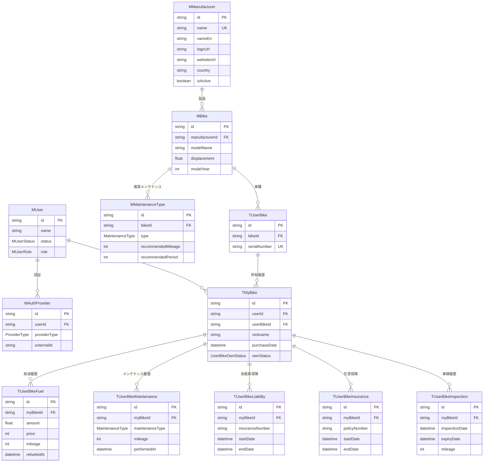

# DBスキーマ設計

## 基本

### 命名規則

- テーブル名は`UpperCamelCase`を使用
- カラム名は`lowerCamelCase`を使用
- プレフィックスは次のルールに従う
  - マスターテーブル: `M` (例: `MUser`, `MProduct`)
  - トランザクションテーブル: `T` (例: `TOrder`, `TPayment`)
  - ログテーブル: `L` (例: `LLogin`, `LTransaction`)

## テーブル設計

### 概念の整理

このアプリケーションでは、バイクに関連する3つの重要な概念を分離しています：

- **MBike**: バイク車種マスタ（例：Honda CB400SF 2023年モデル）
- **TUserBike**: 物理的なバイクの実体（車台番号で識別される個体）
- **TMyBike**: ユーザー視点の「マイバイク」（所有履歴・個人設定を含む）

TMyBikeを導入することで、中古売買時に前オーナーのデータ（給油履歴、メンテナンス履歴等）が次のオーナーに見えないようにプライバシーを保護します。

### ERダイアグラム

### 定義済みテーブル

| テーブル名        | 説明                                             | 実装状況 |
| ----------------- | ------------------------------------------------ | -------- |
| MUser             | ユーザー情報を格納するマスターテーブル           | ✅       |
| MAuthProvider     | 認証情報を格納するマスターテーブル               | ✅       |
| MManufacturer     | バイクメーカー情報を格納するマスターテーブル     | ✅       |
| MBike             | バイク車種マスターテーブル（同じシリーズでも年式別） | ✅       |
| MMaintenanceType  | メンテナンス種類情報を格納するマスターテーブル   | ✅       |
| TUserBike         | 物理的なバイクの実体（車台番号で識別）           | ✅       |
| TMyBike           | ユーザー視点の「マイバイク」（所有履歴・ニックネーム等） | ✅       |
| TUserBikeFuel     | マイバイクの燃料履歴情報を格納するテーブル       | ✅       |

### 未定義テーブル（実装予定）

| テーブル名           | 説明                                       | 優先度 |
| -------------------- | ------------------------------------------ | ------ |
| TUserBikeMaintenance | マイバイクのメンテナンス履歴情報を格納するテーブル | 🔴 高  |
| TUserBikeLiability   | マイバイクの自賠責履歴情報を格納するテーブル | 🟡 中  |
| TUserBikeInsurance   | マイバイクの任意保険履歴情報を格納するテーブル | 🟡 中  |
| TUserBikeInspection  | マイバイクの車検履歴情報を格納するテーブル | 🟡 中  |
| LUserSyncLog         | 同期実施情報を格納するログテーブル         | 🟢 低  |
