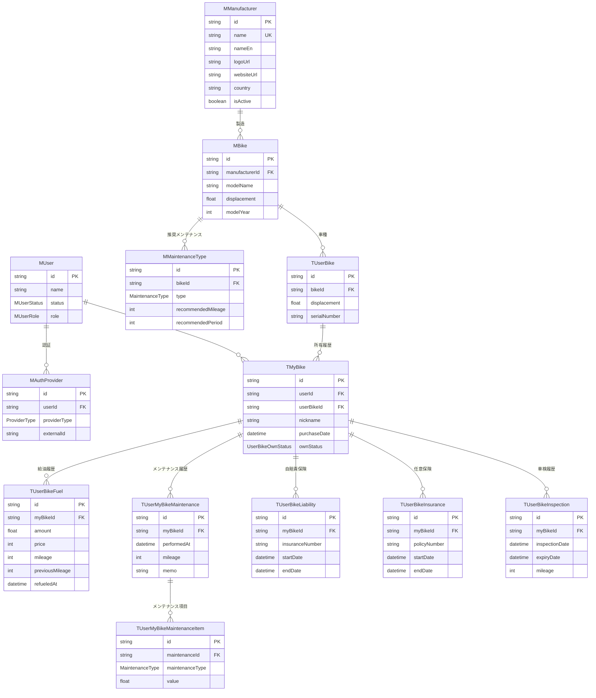

# DBスキーマ設計

## テーブル設計

```mermaid
erDiagram
    MUser ||--o{ MAuthProvider : "認証"
    MUser ||--o{ TMyBike : "所有"

    MManufacturer ||--o{ MBike : "製造"

    MBike ||--o{ MMaintenanceType : "推奨メンテナンス"
    MBike ||--o{ TUserBike : "車種"

    TUserBike ||--o{ TMyBike : "所有履歴"

    TMyBike ||--o{ TUserBikeFuel : "給油履歴"
    TMyBike ||--o{ TUserMyBikeMaintenance : "メンテナンス履歴"
    TUserMyBikeMaintenance ||--o{ TUserMyBikeMaintenanceItem : "メンテナンス項目"
    TMyBike ||--o{ TUserBikeLiability : "自賠責保険"
    TMyBike ||--o{ TUserBikeInsurance : "任意保険"
    TMyBike ||--o{ TUserBikeInspection : "車検履歴"

    MUser {
        string id PK
        string name
        MUserStatus status
        MUserRole role
    }

    MAuthProvider {
        string id PK
        string userId FK
        ProviderType providerType
        string externalId
    }

    MManufacturer {
        string id PK
        string name UK
        string nameEn
        string logoUrl
        string websiteUrl
        string country
        boolean isActive
    }

    MBike {
        string id PK
        string manufacturerId FK
        string modelName
        float displacement
        int modelYear
    }

    MMaintenanceType {
        string id PK
        string bikeId FK
        MaintenanceType type
        int recommendedMileage
        int recommendedPeriod
    }

    TUserBike {
        string id PK
        string bikeId FK
        float displacement
        string serialNumber
    }

    TMyBike {
        string id PK
        string userId FK
        string userBikeId FK
        string nickname
        datetime purchaseDate
        UserBikeOwnStatus ownStatus
    }

    TUserBikeFuel {
        string id PK
        string myBikeId FK
        float amount
        int price
        int mileage
        int previousMileage
        datetime refueledAt
    }

    TUserMyBikeMaintenance {
        string id PK
        string myBikeId FK
        datetime performedAt
        int mileage
        string memo
    }

    TUserMyBikeMaintenanceItem {
        string id PK
        string maintenanceId FK
        MaintenanceType maintenanceType
        float value
    }

    TUserBikeLiability {
        string id PK
        string myBikeId FK
        string insuranceNumber
        datetime startDate
        datetime endDate
    }

    TUserBikeInsurance {
        string id PK
        string myBikeId FK
        string policyNumber
        datetime startDate
        datetime endDate
    }

    TUserBikeInspection {
        string id PK
        string myBikeId FK
        datetime inspectionDate
        datetime expiryDate
        int mileage
    }
```

### 定義済みテーブル

| テーブル名       | 説明                                                     | 実装状況 |
| ---------------- | -------------------------------------------------------- | -------- |
| MUser            | ユーザー情報を格納するマスターテーブル                   | ✅       |
| MAuthProvider    | 認証情報を格納するマスターテーブル                       | ✅       |
| MManufacturer    | バイクメーカー情報を格納するマスターテーブル             | ✅       |
| MBike            | バイク車種マスターテーブル（同じシリーズでも年式別）     | ✅       |
| MMaintenanceType | メンテナンス種類情報を格納するマスターテーブル           | ✅       |
| TUserBike        | 物理的なバイクの実体（車台番号で識別）                   | ✅       |
| TMyBike          | ユーザー視点の「マイバイク」（所有履歴・ニックネーム等） | ✅       |
| TUserBikeFuel    | マイバイクの燃料履歴情報を格納するテーブル               | ✅       |
| TUserMyBikeMaintenance | マイバイクのメンテナンス履歴情報を格納するテーブル   | ✅       |
| TUserMyBikeMaintenanceItem | メンテナンス項目ごとの入力値を格納するテーブル | ✅       |

### 未定義テーブル（実装予定）

| テーブル名           | 説明                                               | 優先度 |
| -------------------- | -------------------------------------------------- | ------ |
| TUserBikeLiability   | マイバイクの自賠責履歴情報を格納するテーブル       | 🟡 中  |
| TUserBikeInsurance   | マイバイクの任意保険履歴情報を格納するテーブル     | 🟡 中  |
| TUserBikeInspection  | マイバイクの車検履歴情報を格納するテーブル         | 🟡 中  |
| LUserSyncLog         | 同期実施情報を格納するログテーブル                 | 🟢 低  |
