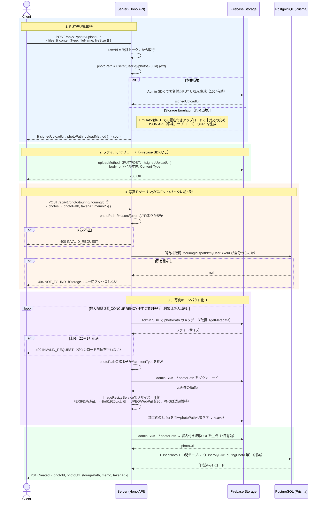
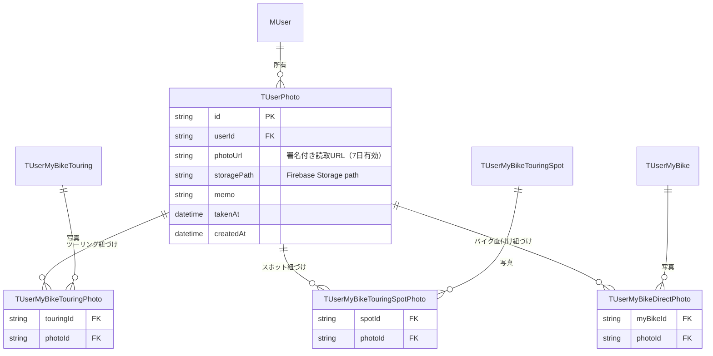
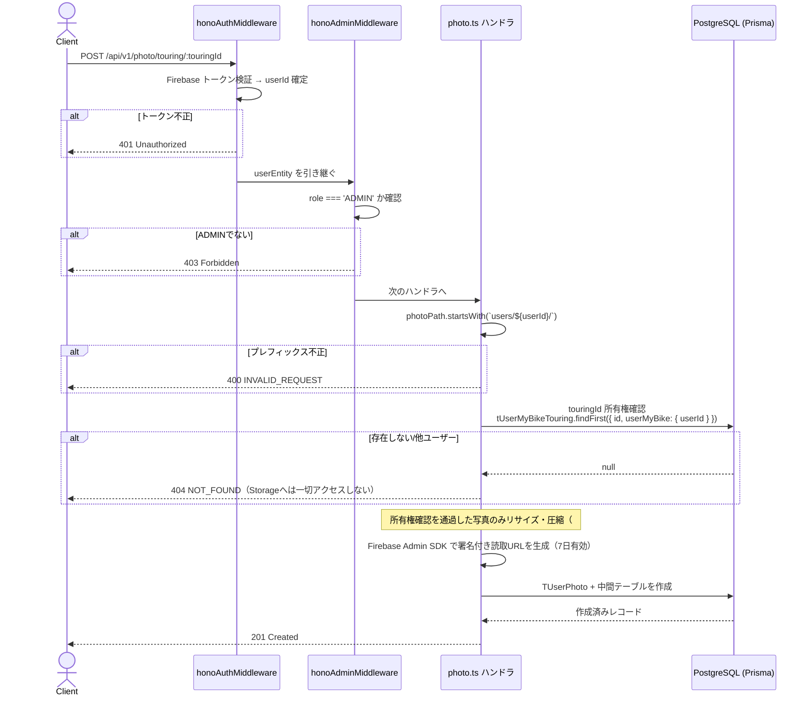

# 写真アップロードアーキテクチャ

ツーリング・スポット・バイク本体への写真投稿機能の設計ドキュメントです。

---

## 設計方針

- **Storage キーはサーバーで生成する**: クライアントに任意のパスを指定させると他ユーザーの領域を上書きできるため、サーバーが UUID でキーを発行する
- **写真の所有権はユーザー**: バイクではなくユーザーに紐づく（複数バイクをまたいで管理可能）
- **Firebase SDK をクライアントに持たせない**: 署名付き URL の PUT で直接アップロードし、Firebase Client SDK 不要
- **写真は複数の対象に紐づけ可能**: `TUserPhoto` 1件がツーリング・スポット・バイクいずれとも中間テーブルで結びつくため、同じ写真を複数の対象に紐づけることをDB制約でブロックしない

---

## アップロードフロー



> **写真のコンパクト化について（#560）**: クライアント直接PUTのフロー自体は変更せず、「写真を紐づけるAPI」（`POST /photo/touring/:touringId` 等）の中でリサイズ・圧縮する方式を採用している。元サイズのまま保存されレンダリングが遅くなる問題を、既存アーキテクチャを維持したまま解消するため。contentTypeはリクエストスキーマに含まれないため、`photoPath` の拡張子（サーバーが `/upload-url` 発行時に決定したもの）から推測する。
>
> - **所有権確認を先に行う**: リサイズ・書き戻しは所有権確認（`PhotoService.requireTouringOwnership` 等）を通過した後にのみ実行する。存在しない・他ユーザー所有のIDを指定した不正なリクエストでStorageへ副作用（ダウンロード・書き戻し）を与えないため
> - **ダウンロード前にファイルサイズを検証する**: `/upload-url` で申告された `fileSize` はクライアントの自己申告であり、署名付きPUT URL自体はアップロードされる実際のバイト数を制限しないため信用できない。登録時に `file.getMetadata()` でStorage上の実オブジェクトサイズを確認し、上限（`PHOTO_MAX_FILE_SIZE_BYTES` = 20MB）を超える場合はダウンロード自体を行わずに400を返す
> - **並列実行数を制限する**: 巨大な画像を複数枚同時にBuffer展開するとメモリを圧迫するため、`RESIZE_CONCURRENCY`（3件）ずつに分けて処理する
>
> 詳細は「制約・仕様」節を参照。

---

## APIエンドポイント

すべて `honoAuthMiddleware` + `honoAdminMiddleware` による認証必須・**ADMINロール限定**。

> Storage設定を含め新規追加の機能のため、現時点では一般ユーザーには公開しない。
> クライアント側もプロフィール画面の「マイフォト」リンク・バイク詳細/ツーリング詳細の写真カードを
> `role === 'ADMIN'` の場合のみ表示する。

| メソッド | パス                               | 説明                                                                |
| -------- | ---------------------------------- | ------------------------------------------------------------------- |
| POST     | `/api/v1/photo/upload-url`         | 署名付きアップロードURL生成                                         |
| POST     | `/api/v1/photo/touring/:touringId` | ツーリングへの写真登録                                              |
| GET      | `/api/v1/photo/touring/:touringId` | ツーリングの写真一覧（takenAt昇順）                                 |
| POST     | `/api/v1/photo/spot/:spotId`       | スポットへの写真登録                                                |
| GET      | `/api/v1/photo/spot/:spotId`       | スポットの写真一覧（takenAt昇順）                                   |
| POST     | `/api/v1/photo/bike/:myUserBikeId` | バイク本体への写真登録（ツーリング/スポットを介さない日常の1枚）    |
| GET      | `/api/v1/photo/bike/:myUserBikeId` | バイク本体に直接紐づく写真一覧（takenAt昇順）                       |
| GET      | `/api/v1/photo`                    | マイフォト・ギャラリー（全写真横断、ページネーション、takenAt降順） |
| DELETE   | `/api/v1/photo/:photoId`           | 写真削除（Storage上のファイルも削除）                               |

### POST `/api/v1/photo/upload-url`

```json
// Request
{
  "files": [
    { "contentType": "image/jpeg", "fileName": "photo1.jpg", "fileSize": 1024000 },
    { "contentType": "image/png",  "fileName": "photo2.png", "fileSize": 512000  }
  ]
}
// files: 1〜10件。contentType は "image/jpeg" | "image/png" | "image/webp"

// Response 200
{
  "status": "success",
  "data": [
    {
      "signedUploadUrl": "https://storage.googleapis.com/...",
      "photoPath": "users/abc123/photos/550e8400-e29b-41d4-a716.jpg",
      "uploadMethod": "PUT"
    }
  ]
}
// uploadMethod: 本番は "PUT"（署名付きURL）。Storage Emulatorでは "POST"（単純アップロード）
```

### POST `/api/v1/photo/touring/:touringId`

```json
// Request
{
  "photos": [
    {
      "photoPath": "users/abc123/photos/550e8400-e29b-41d4-a716.jpg",
      "takenAt": "2024-06-01T10:30:00.000Z",
      "memo": "山頂からの景色"  // optional
    }
  ]
}

// Response 201
{
  "status": "success",
  "data": [
    {
      "photoId": "...",
      "photoUrl": "https://storage.googleapis.com/...",
      "storagePath": "users/abc123/photos/...",
      "memo": "山頂からの景色",
      "takenAt": "2024-06-01T10:30:00.000Z"
    }
  ]
}
```

`POST /api/v1/photo/spot/:spotId` ・ `POST /api/v1/photo/bike/:myUserBikeId` もリクエスト/レスポンス形式は同様（紐づけ先が spot / バイク本体になるのみ）。

### GET `/api/v1/photo`

```
GET /api/v1/photo?page=1&per-size=30
```

```json
// Response 200
{
  "status": "success",
  "data": [
    {
      "photoId": "...",
      "photoUrl": "https://storage.googleapis.com/...",
      "storagePath": "users/abc123/photos/...",
      "memo": "山頂からの景色",
      "takenAt": "2024-06-01T10:30:00.000Z",
      "attachments": [{ "type": "TOURING", "touringId": "..." }]
    }
  ]
}
// page省略時: 1 / per-size省略時: 30（最大100）
// attachments: 写真がどのツーリング/スポット/バイクに紐づいているかの一覧（複数持つ場合もある）
```

---

## DBスキーマ



### 設計のポイント

- `TUserPhoto` が写真そのもの（1レコード = 1ファイル）。特定のバイクにスコープされず、ユーザーにのみ紐づく
- `TUserMyBikeTouringPhoto` / `TUserMyBikeTouringSpotPhoto` / `TUserMyBikeDirectPhoto` は中間テーブルで、いずれも `(親キー, photoId)` の複合主キーのみを持つ
  - `photoId` に UNIQUE 制約はなく、1枚の写真が複数のツーリング/スポット/バイクに紐づくことをブロックしない
  - 中間テーブル同士の相互排他は DB 制約ではなく、各 `create*` メソッドの呼び分け（`PrismaPhotoRepository`）で保証している
- 並び順は `orderIndex` のような専用カラムを持たず、`takenAt`（同一時刻は `createdAt`）でソートする
  - ツーリング/スポット/バイクの一覧は昇順、マイフォト・ギャラリー（`GET /api/v1/photo`）は降順

---

## Firebase Storage のパス設計

```
users/
  {userId}/
    photos/
      {uuid}.jpg
      {uuid}.png
      ...
```

- ユーザーIDでディレクトリを分離してアクセス制御しやすくする
- サーバーが UUID でファイル名を発行（クライアントは指定不可）
- 写真登録 API でパスが `users/{認証済みuserId}/` 始まりかを検証し、他ユーザー領域への侵入を防ぐ

---

## セキュリティ検証フロー



spot / バイク本体への登録も同じ検証順序（認証 → ADMIN確認 → パスプレフィックス検証 → 所有権確認 → リサイズ → 署名付きURL生成 → DB作成）を辿る。所有権確認の対象が `touringId` → `spotId` / `myUserBikeId` に置き換わるのみ。

---

## サーバー実装ファイル

| ファイル                                                        | 役割                                               |
| --------------------------------------------------------------- | -------------------------------------------------- |
| `apps/web/lib/firebase/adminStorage.ts`                         | Firebase Admin Storage クライアント初期化          |
| `apps/web/lib/api/server/v1/photo.ts`                           | エンドポイント定義・Storage 操作・リサイズ処理の呼び出し |
| `apps/web/lib/api/server/services/ImageResizeService.ts`        | 写真のリサイズ・圧縮（Buffer→Bufferの純粋な画像加工、Storage操作は含まない） |
| `apps/web/lib/api/server/services/PhotoService.ts`              | ビジネスロジック（登録・取得・削除の権限チェック） |
| `apps/web/lib/api/server/interfaces/IPhotoRepository.ts`        | リポジトリインターフェース                         |
| `apps/web/lib/api/server/repositories/PrismaPhotoRepository.ts` | DB アクセス                                        |
| `apps/web/lib/api/server/entities/PhotoEntity.ts`               | ドメインエンティティ                               |

## クライアント実装ファイル

| ファイル                                          | 役割                                                       |
| ------------------------------------------------- | ---------------------------------------------------------- |
| `apps/web/components/photo/TouringPhotosCard.tsx` | ツーリング写真の表示・アップロード・削除 UI                |
| `apps/web/components/photo/BikePhotosCard.tsx`    | バイク本体写真（直付け）の表示・アップロード・削除 UI      |
| `apps/web/app/app/(protected)/photos/page.tsx`    | マイフォト・ギャラリー（全写真横断、無限スクロール）ページ |

---

## 制約・仕様

| 項目                                 | 値                                                             |
| ------------------------------------ | -------------------------------------------------------------- |
| 対応フォーマット                     | JPEG / PNG / WebP                                              |
| 1リクエストあたり最大枚数            | 10枚                                                           |
| 署名付きアップロードURLの有効期限    | 15分                                                           |
| 署名付き読取URLの有効期限            | 7日（GCS V4署名付きURLの仕様上の上限）                         |
| アップロード方式                     | 本番: 署名付きPUT / Storage Emulator: 単純アップロード（POST） |
| マイフォト・ギャラリーのページサイズ | 30件（省略時）、最大100件                                      |
| リサイズ後の長辺上限                 | 1920px（`fit: 'inside', withoutEnlargement: true`、アップスケールしない）|
| リサイズ後の品質（JPEG/WebP）        | 80                                                              |
| リサイズ時のPNG扱い                  | 透過を維持しリサイズのみ（JPEG変換はしない）                   |
| アップロード可能な1ファイルの最大サイズ | 20MB（`PHOTO_MAX_FILE_SIZE_BYTES`）。`/upload-url` 申告時の `fileSize` バリデーションに加え、登録時に `file.getMetadata()` でStorage上の実サイズも検証する |
| リサイズ処理の並列実行数上限         | 3件（`RESIZE_CONCURRENCY`）。対象写真は最大10枚だが、同時Buffer展開によるメモリ圧迫を避けるためチャンク分割して処理する |

---

## 本番環境の Firebase Storage セキュリティルール

`development/firebase_emulator/storage.rules` はローカル開発用エミュレータのみに適用される設定であり、
本番プロジェクトのFirebase Storageには自動反映されない（このリポジトリのCI/CDに `firebase deploy` 相当のstorage rulesデプロイ手順は存在しない）。

そのため、本番公開前に以下をFirebase Consoleまたは別途の手順で本番プロジェクトに設定する必要がある。

- 認証済みユーザーのみ読み書き可能なルール（最低限エミュレータと同等のもの）
- 可能であれば `users/{userId}/photos/{fileName}` のパスに対し、リクエストユーザー自身の領域のみ書き込みを許可するルールへ強化する
