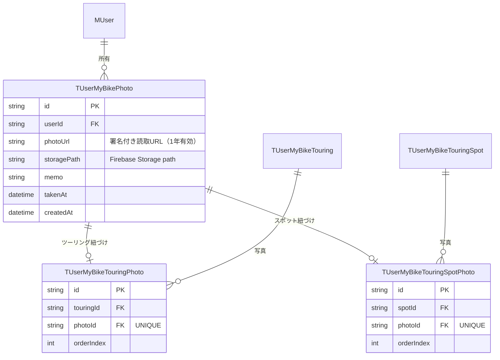

# 写真アップロードアーキテクチャ

ツーリング・スポットへの写真投稿機能の設計ドキュメントです。

---

## 設計方針

- **Storage キーはサーバーで生成する**: クライアントに任意のパスを指定させると他ユーザーの領域を上書きできるため、サーバーが UUID でキーを発行する
- **写真の所有権はユーザー**: バイクではなくユーザーに紐づく（複数バイクをまたいで管理可能）
- **Firebase SDK をクライアントに持たせない**: 署名付き URL の PUT で直接アップロードし、Firebase Client SDK 不要

---

## アップロードフロー

```
┌─────────────────────────────────────────────────────────┐
│ 1. PUT先URL取得                                          │
│                                                         │
│  Client ──POST /api/v1/photo/upload-url──► Server       │
│          { contentType, count }                         │
│                                                         │
│          Server (firebase-admin):                       │
│            - userId = 認証トークンから取得               │
│            - path = users/{userId}/photos/{uuid}.{ext}  │
│            - Admin SDK で署名付きPUT URL を生成          │
│                                                         │
│  Client ◄── [{ signedUploadUrl, photoPath }] × count ──┘
│          ※ signedUploadUrl は15分で失効
│
├─────────────────────────────────────────────────────────┐
│ 2. ファイルアップロード（Firebase SDKなし）              │
│                                                         │
│  Client ──PUT {signedUploadUrl}──► Firebase Storage     │
│          body: ファイル本体                              │
│          Content-Type: image/jpeg 等                    │
│                                                         │
│  ※ 署名済みURLへの直接PUT。認証ヘッダー不要             │
│
├─────────────────────────────────────────────────────────┐
│ 3. 写真をHistoryに紐づけ                                │
│                                                         │
│  Client ──POST /api/v1/photo/touring/:touringId──► Server│
│          { photos: [{ photoPath, takenAt, memo? }] }    │
│                                                         │
│          Server:                                        │
│            - touringId の所有権確認（Prisma）           │
│            - photoPath が users/{userId}/ 始まりか検証  │
│            - Admin SDK で photoPath → 署名付き読取URL   │
│            - TUserMyBikePhoto + TUserMyBikeTouringPhoto │
│              レコードを作成                             │
└─────────────────────────────────────────────────────────┘
```

---

## APIエンドポイント

すべて `honoAuthMiddleware` による認証必須。

| メソッド | パス | 説明 |
|---|---|---|
| POST | `/api/v1/photo/upload-url` | 署名付きアップロードURL生成 |
| POST | `/api/v1/photo/touring/:touringId` | ツーリングへの写真登録 |
| GET  | `/api/v1/photo/touring/:touringId` | ツーリングの写真一覧（orderIndex昇順） |
| POST | `/api/v1/photo/spot/:spotId` | スポットへの写真登録 |
| GET  | `/api/v1/photo/spot/:spotId` | スポットの写真一覧（orderIndex昇順） |
| DELETE | `/api/v1/photo/:photoId` | 写真削除（Storage上のファイルも削除） |

### POST `/api/v1/photo/upload-url`

```json
// Request
{
  "files": [
    { "contentType": "image/jpeg", "fileName": "photo1.jpg", "fileSize": 1024000 },
    { "contentType": "image/png",  "fileName": "photo2.png", "fileSize": 512000  }
  ]
}
// files: 1〜10件。contentType は "image/jpeg" | "image/png" | "image/webp"

// Response 200
{
  "status": "success",
  "data": [
    {
      "signedUploadUrl": "https://storage.googleapis.com/...",
      "photoPath": "users/abc123/photos/550e8400-e29b-41d4-a716.jpg"
    }
  ]
}
```

### POST `/api/v1/photo/touring/:touringId`

```json
// Request
{
  "photos": [
    {
      "photoPath": "users/abc123/photos/550e8400-e29b-41d4-a716.jpg",
      "takenAt": "2024-06-01T10:30:00.000Z",
      "memo": "山頂からの景色"  // optional
    }
  ]
}

// Response 201
{
  "status": "success",
  "data": [
    {
      "photoId": "...",
      "photoUrl": "https://storage.googleapis.com/...",
      "storagePath": "users/abc123/photos/...",
      "memo": "山頂からの景色",
      "takenAt": "2024-06-01T10:30:00.000Z",
      "orderIndex": 0
    }
  ]
}
```

---

## DBスキーマ



### 設計のポイント

- `TUserMyBikePhoto` が写真そのもの（1レコード = 1ファイル）
- `TUserMyBikeTouringPhoto` / `TUserMyBikeTouringSpotPhoto` は中間テーブル
  - 1枚の写真がツーリング全体とスポットの両方に属することはない（`photoId` に UNIQUE 制約）
  - `orderIndex` は中間テーブルが持つ（写真自体は順序を持たない）
- 新しく写真を追加するとき、既存の最大 `orderIndex + 1` から連番で付番する

---

## Firebase Storage のパス設計

```
users/
  {userId}/
    photos/
      {uuid}.jpg
      {uuid}.png
      ...
```

- ユーザーIDでディレクトリを分離してアクセス制御しやすくする
- サーバーが UUID でファイル名を発行（クライアントは指定不可）
- 写真登録 API でパスが `users/{認証済みuserId}/` 始まりかを検証し、他ユーザー領域への侵入を防ぐ

---

## セキュリティ検証フロー

```
POST /api/v1/photo/touring/:touringId
  │
  ├─ 1. honoAuthMiddleware: Firebase トークン検証 → userId 確定
  │
  ├─ 2. touringId 所有権確認:
  │      prisma.tUserMyBikeTouring.findFirst({
  │        where: { id: touringId, userMyBike: { userId } }
  │      })
  │      → 存在しない/他ユーザー → 404
  │
  ├─ 3. photoPath プレフィックス検証:
  │      photoPath.startsWith(`users/${userId}/`)
  │      → false → 400 INVALID_REQUEST
  │
  └─ 4. Firebase Admin SDK で署名付き読取 URL を生成して DB に保存
```

---

## サーバー実装ファイル

| ファイル | 役割 |
|---|---|
| `apps/web/lib/firebase/adminStorage.ts` | Firebase Admin Storage クライアント初期化 |
| `apps/web/lib/api/server/v1/photo.ts` | エンドポイント定義・Storage 操作 |
| `apps/web/lib/api/server/services/PhotoService.ts` | ビジネスロジック（orderIndex 計算・権限チェック） |
| `apps/web/lib/api/server/repositories/PrismaPhotoRepository.ts` | DB アクセス |
| `apps/web/lib/api/server/entities/PhotoEntity.ts` | ドメインエンティティ |

## クライアント実装ファイル

| ファイル | 役割 |
|---|---|
| `apps/web/components/photo/TouringPhotosCard.tsx` | ツーリング写真の表示・アップロード・削除 UI |

---

## 制約・仕様

| 項目 | 値 |
|---|---|
| 対応フォーマット | JPEG / PNG / WebP |
| 1リクエストあたり最大枚数 | 10枚 |
| 署名付きアップロードURLの有効期限 | 15分 |
| 署名付き読取URLの有効期限 | 1年 |
