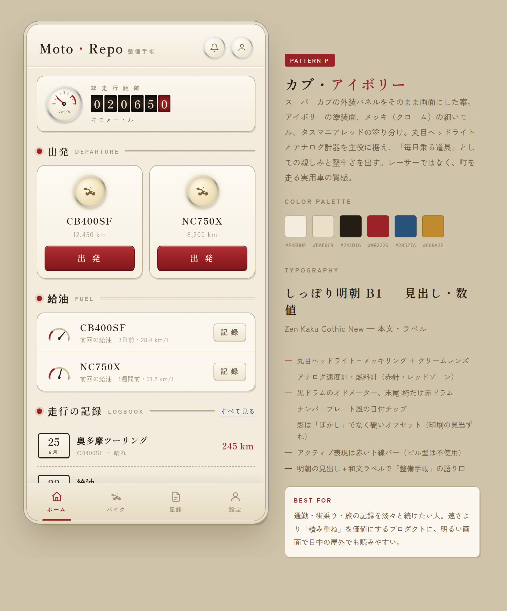
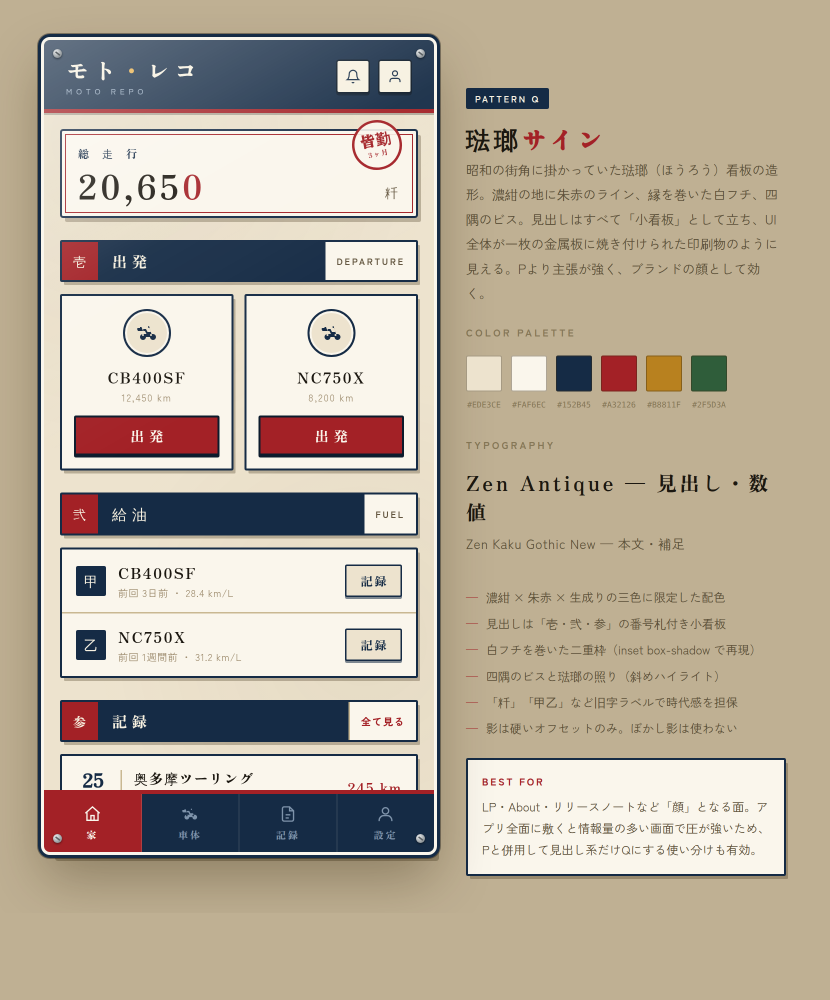
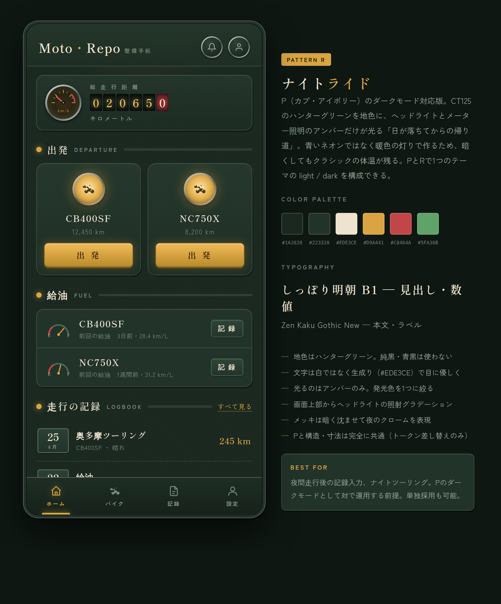

# クラシック（カブ）方向のデザイン検討

「今のデザインがいかにもAI開発に見える」という課題に対して、レーサー感ではなく
**スーパーカブで町を走っているようなクラシック感** を出す方向を検討した記録。

対象パターン:

| ID | 名称 | ファイル | プレビュー |
|---|---|---|---|
| P | カブ・アイボリー | [`P-cub-ivory.html`](./P-cub-ivory.html) | [`previews/P-cub-ivory.png`](./previews/P-cub-ivory.png) |
| Q | 琺瑯サイン | [`Q-horo-sign.html`](./Q-horo-sign.html) | [`previews/Q-horo-sign.png`](./previews/Q-horo-sign.png) |
| R | ナイトライド | [`R-night-ride.html`](./R-night-ride.html) | [`previews/R-night-ride.png`](./previews/R-night-ride.png) |

---

## 1. 現状が「AI開発っぽく」見える原因

印象論ではなく、現行コードに実在する具体的な要因を挙げる。

| # | 箇所 | 現状 | なぜAIっぽく見えるか |
|---|---|---|---|
| 1 | `apps/web/app/layout.tsx` | フォントが **Geist**（`GeistVF.woff`） | Vercelのデフォルトフォント。Next.js のテンプレートをそのまま使った画面と同じ字面になる |
| 2 | `packages/theme/src/themes.ts` | `product: #0070F3` | **Vercel ブルーそのもの**。生成されたUIで最も頻出する色 |
| 3 | 同上（dark） | `background: #0F172A` | **Tailwind の `slate-900` の生値**。ダークテーマの既定値として使い回される代表色 |
| 4 | 同上 | `radius` が `0.25 / 0.5 / 1rem` の等比、全要素で同じ角丸 | 「全部同じ丸み」はテンプレートの徴候。実物の工業製品は部位ごとに曲率が違う |
| 5 | 同上 | `shadows` がすべて **ぼかし影**（`0 4px 6px rgba(0,0,0,.1)`） | Material 由来の浮遊カード。素材感がなく、どのアプリでも同じ見え方になる |
| 6 | `apps/web/app/globals.css:137` | `* { transition: background-color 0.3s ease }` | 全要素へのワイルドカード指定。設計されたモーションではなく「とりあえず」の記述 |
| 7 | 既存モックアップ（A・B・E など） | アイコンが絵文字（🏍️ ⛽ 📋 👤） | 素材を用意せずに済ませた記号。ブランドの手触りが出ない |

要するに **「Geist + #0070F3 + slate-900 + 均一角丸 + ぼかし影」** という、
生成物に最も出現しやすい組み合わせがそのまま揃っている状態。
ここを崩さない限り、レイアウトを変えても同じ印象は残る。

---

## 2. 「カブ感」を何で作るか

レーサー（＝A/D/E 系の黒地・蛍光色・斜体・攻撃的な角）とは逆側の要素を積む。

| 要素 | レーサー的 | カブ＝実用車クラシック |
|---|---|---|
| 地色 | 黒・カーボン | 生成り・アイボリー（外装パネルの塗装面） |
| 差し色 | 蛍光オレンジ／ネオン緑 | タスマニアレッド `#9B2226`、パールブルー、ハンターグリーン |
| 金属 | カーボン／アルマイト | **メッキ（クローム）** の細いモール |
| 形 | 鋭角・斜体・非対称 | **丸目ヘッドライト**、素直な左右対称、寛容なR |
| 計器 | デジタル・バーグラフ | **アナログ針・ドラム式オドメーター** |
| 書体 | 圧縮ゴシック（Oswald 等） | 明朝／昭和の看板書体 + 温かみのある和文ゴシック |
| 影 | 発光・グロー | **印刷の見当ずれのような硬いオフセット影** |
| 語り口 | "START" "READY TO RIDE" | 「出発」「給油」「走行の記録」「整備手帳」 |

特に効くのは次の3点。

1. **メッキと塗装の対比** — ぼかし影をやめ、`linear-gradient` のクロームと `inset` のハイライトで
   「金属に塗装が乗っている」質感を出す。これだけで生成物っぽさがかなり抜ける。
2. **丸（円）を主役にする** — 丸目ヘッドライト、アナログメーター。四角いカードの羅列を崩す。
3. **和文の語り口** — ラベルを英語から日本語に戻す。`START` ではなく `出発`。
   既存パターンJ（Retro Dashboard）は英語ラベル＋Oswald で、結果として
   「アメリカのヴィンテージ／カフェレーサー」寄りになっている。ここが今回との分岐点。

---

## 3. 3案の比較

### P — カブ・アイボリー（推奨）



スーパーカブの外装パネルをそのまま画面にした案。アイボリーの塗装面、メッキの細いモール、
タスマニアレッドの塗り分け。丸目ヘッドライトとアナログ計器を主役に据える。

- 総走行距離は **黒ドラムのオドメーター**（末尾1桁だけ赤ドラム）
- 給油行は **アナログ燃料計（E–F・赤針）** で残量を一目で伝える
- 日付は **ナンバープレート風のチップ**
- ナビのアクティブ表現は **赤い下線バー**（ピル型の blob を使わない）
- 影は「ぼかし」ではなく硬いオフセット
- 見出し: しっぽり明朝 B1 / 本文: Zen Kaku Gothic New

日常的に開くアプリ本体に最も適する。明るいので日中の屋外でも読める。

### Q — 琺瑯サイン



昭和の街角の琺瑯（ほうろう）看板の造形。濃紺の地に朱赤のライン、縁を巻いた白フチ、四隅のビス。
見出しがすべて「小看板」として立ち、UI全体が一枚の金属板に焼き付けられた印刷物に見える。

- 「壱・弐・参」の番号札、「粁」「甲乙」などの旧字ラベル
- 濃紺 × 朱赤 × 生成りの三色に限定
- 書体は Zen Antique

主張が強くブランドの顔として効く反面、情報量の多い一覧画面に全面適用すると圧が強い。
**LP・About・リリースノートなどの「顔」に限定**するか、Pと併用して見出し系だけQにするのが現実的。

### R — ナイトライド



Pのダークモード対応版。CT125のハンターグリーンを地色に、ヘッドライトとメーター照明の
アンバーだけが光る「日が落ちてからの帰り道」。

- 地色は純黒でも青黒（slate-900）でもなく **ハンターグリーン `#1A2820`**
- 文字は白ではなく **生成り `#EDE3CE`**（暗所でのハレーションを抑える）
- 発光色は **アンバー1色に限定**。青いネオンを使わないので暗くしてもクラシックの体温が残る
- Pと構造・寸法は完全に共通。**トークンの差し替えだけで light / dark を構成できる**

### まとめ

| | P カブ・アイボリー | Q 琺瑯サイン | R ナイトライド |
|---|---|---|---|
| 明暗 | ライト | ライト | ダーク |
| クラシック度 | 中〜高 | 高 | 中〜高 |
| 情報密度への耐性 | ◎ | △ | ◎ |
| 実装コスト | 中 | 中〜高 | 中（Pと共通） |
| 想定用途 | アプリ本体 | LP・About・顔となる面 | アプリ本体のダークモード |

**推奨は P を主、R をそのダークモードとして採用**し、Q は LP など限定面で使う構成。
P と R は寸法・構造が同一なので、テーマ1つの light / dark として無理なく同居できる。

---

## 4. `packages/theme` への適用案

### 4-1. カラートークン（P = light）

| トークン | 現行 | 提案 | 意図 |
|---|---|---|---|
| `background` | `#FFFFFF` | `#F4EDDF` | 外装パネルのアイボリー |
| `cloud` | `#F7F7F7` | `#EAE0C9` | 沈んだ面 |
| `cloudHover` | `#E1E1E1` | `#DED2B6` | |
| `cloudActive` | `#CFCFCF` | `#CBBB98` | |
| `product` | `#0070F3` | `#9B2226` | タスマニアレッド |
| `productHover` | `#005FCC` | `#7F181C` | |
| `productActive` | `#004299` | `#6B1215` | |
| `success` | `#3bceac` | `#3E6B3A` | ハンターグリーン |
| `successHover` | `#32b89c` | `#345A31` | |
| `successActive` | `#279f85` | `#2A4A28` | |
| `danger` | `#CC0000` | `#A32126` | 朱赤 |
| `dangerHover` | `#AA0000` | `#871A1E` | |
| `dangerActive` | `#880000` | `#6B1215` | |
| `warning` | `#FFD166` | `#C08A2E` | 計器のアンバーランプ |
| `warningHover` | `#E6B800` | `#A5741F` | |
| `warningActive` | `#CC9900` | `#8A6018` | |
| `social` | `#3B5998` | `#28527A` | パールブルー |
| `socialHover` | `#2D4373` | `#1F4160` | |
| `socialActive` | `#1A2A4A` | `#163049` | |
| `ink` | `#324256` | `#241D16` | 温かみのある黒（青みを抜く） |
| `inkLight` | `#4E5C6F` | `#6E6152` | |
| `inkDark` | `#0B0C0F` | `#14100B` | |

### 4-2. カラートークン（R = dark）

| トークン | 現行 | 提案 |
|---|---|---|
| `background` | `#0F172A` | `#1A2820` |
| `cloud` | `#676767` | `#22332A` |
| `cloudHover` | `#818181` | `#2A3E33` |
| `cloudActive` | `#4b4b4b` | `#33493C` |
| `product` | `#38BDF8` | `#D9A441` |
| `productHover` | `#0EA5E9` | `#F0BC5C` |
| `productActive` | `#0284C7` | `#B98B2E` |
| `success` | `#34D399` | `#5FA36B` |
| `danger` | `#F87171` | `#C0464A` |
| `warning` | `#FBBF24` | `#E0B45E` |
| `social` | `#8B9DC3` | `#7E9CB8` |
| `ink` | `#E2E8F0` | `#EDE3CE` |
| `inkLight` | `#94A3B8` | `#AEBBAC` |
| `inkDark` | `#F8FAFC` | `#FBF6EA` |

### 4-3. `product` と `danger` が両方赤になる問題

ブランド色を赤にすると、破壊的操作（`danger`）と色相が近接して区別が曖昧になる。
色だけで解決しようとすると、どちらかがカブらしさを失う。**形で二重に伝える**方針を推奨する。

- **`product`（主要アクション）＝ 塗りつぶしの赤**。塗りの赤は product が独占する
- **`danger`（破壊的操作）＝ 白地 + 赤枠 + 赤文字のアウトライン + アイコン + 確認ダイアログ**

`Button` は既に `outline` プロパティを持つので、`danger` を原則 `outline` 運用にすれば
コンポーネントの追加なしで成立する。

採用しない場合の代替は `product` をパールブルー `#1F4666` にし、赤をロゴ・アクティブ下線・
数値ハイライトだけの差し色に格下げする案。トークン衝突は起きないが、赤の面積が減るぶん
カブらしさは弱まる。

### 4-4. 角丸

均一な等比をやめ、部位ごとに曲率を変える。

| トークン | 現行 | 提案 |
|---|---|---|
| `radius.sm` | `0.25rem` | `0.1875rem` (3px) — プレート・タグ |
| `radius.md` | `0.5rem` | `0.4375rem` (7px) — ボタン |
| `radius.lg` | `1rem` | `0.875rem` (14px) — カード |
| `radius.full` | `9999px` | 変更なし — メーター・ヘッドライト |

### 4-5. 影

ぼかし影を捨て、**硬いオフセット + inset のハイライト**（塗装面の照り）に置き換える。

```ts
// light (P)
shadows: {
  sm: 'inset 0 1px 0 rgba(255,255,255,.9), 2px 3px 0 -1px rgba(120,95,55,.16)',
  md: 'inset 0 1px 0 rgba(255,255,255,.9), 3px 5px 0 -1px rgba(120,95,55,.2)',
  lg: 'inset 0 1px 0 rgba(255,255,255,.9), 6px 10px 0 -2px rgba(120,95,55,.24), 0 20px 40px rgba(70,52,26,.14)',
}
// dark (R)
shadows: {
  sm: 'inset 0 1px 0 rgba(237,227,206,.06), 2px 3px 0 -1px rgba(0,0,0,.4)',
  md: 'inset 0 1px 0 rgba(237,227,206,.06), 3px 5px 0 -1px rgba(0,0,0,.45)',
  lg: 'inset 0 1px 0 rgba(237,227,206,.08), 6px 10px 0 -2px rgba(0,0,0,.5), 0 20px 44px rgba(0,0,0,.5)',
}
```

### 4-6. フォント（トークン未定義 — 追加が必要）

`ThemeTokens` にフォントファミリーの枠がないため、現状は `layout.tsx` に Geist が直書きされている。
テーマで切り替えられるよう `fontFamilies` の追加を提案する。

```ts
fontFamilies: {
  display: "'Shippori Mincho B1', serif",       // 見出し・数値（Qの場合は 'Zen Antique'）
  body: "'Zen Kaku Gothic New', sans-serif",    // 本文・ラベル
}
```

いずれも Google Fonts で入手可能。和文サブセットが大きいため、
`next/font/google` の `subsets` 指定か、使用字種を絞ったサブセット化を前提とする。

---

## 5. トークンだけでは足りない部分

配色を差し替えるだけでは「AIっぽさ」は完全には抜けない。以下はコンポーネント側の変更が要る。

| 対象 | 変更内容 |
|---|---|
| `packages/ui/src/Button/button.module.css` | `:active` の `transform: scale(0.98)` を `translateY(2px)` + `box-shadow` 除去に変更し、**押し込まれる**挙動にする。`primary` に上面ハイライト（`inset 0 1px 0 rgba(255,255,255,.28)`）を追加 |
| `packages/ui/src/BaseCard/baseCard.module.css` | ぼかし影を硬いオフセット影に差し替え |
| `apps/web/app/globals.css:137` | `* { transition: background-color .3s }` を削除し、必要な要素に個別指定 |
| ナビゲーション | アクティブ表現をピル／blob ではなく下線バーに |
| アイコン | 絵文字をやめ、線幅 1.7 のストロークSVGに統一 |
| 新規コンポーネント | `Dial`（アナログメーター）、`Odometer`（ドラム数字）、`FuelGauge`（E–F燃料計）。いずれも純SVG/CSSで実装可能、外部依存なし |

---

## 6. 段階的な導入案

一度に全画面を変えず、影響範囲の小さい順に進める。

1. **配色とフォントの差し替え**（`packages/theme` + `layout.tsx`）
   — 構造を変えないので差分が読みやすく、E2Eへの影響も出ない
2. **`Button` / `BaseCard` の質感調整**（`packages/ui`）
   — Storybook（`pnpm storybook`）で確認しながら進められる
3. **新規コンポーネント追加**（`Dial` / `Odometer` / `FuelGauge`）
   — ホーム画面から適用
4. **ラベルの和文化**（`START` → `出発` など）
   — ここで初めて `apps/e2e` の Page Object Model / spec の文言参照に影響が出るため、
     `apps/e2e/pages` と `apps/e2e/tests` の該当箇所を同一PRで修正する
5. **ダークモード（R）の適用**
6. **LP側へのQ適用**（採用する場合）

---

## 7. E2Eへの影響

**本検討の成果物（`docs/design-patterns/` 配下のHTML・PNG・本ドキュメント）による影響はない。**
`apps/web` のコンポーネント・文言・ロール名を一切変更していないため、
`apps/e2e/pages` および `apps/e2e/tests` の参照先はすべて現状のまま有効。

ただし上記「段階的な導入案」のステップ4（ラベルの和文化）を実施する段階では、
`getByRole('button', { name: ... })` および `getByText()` の引数が影響を受ける。
実装時に `apps/e2e` 側を同一PRで修正すること。
