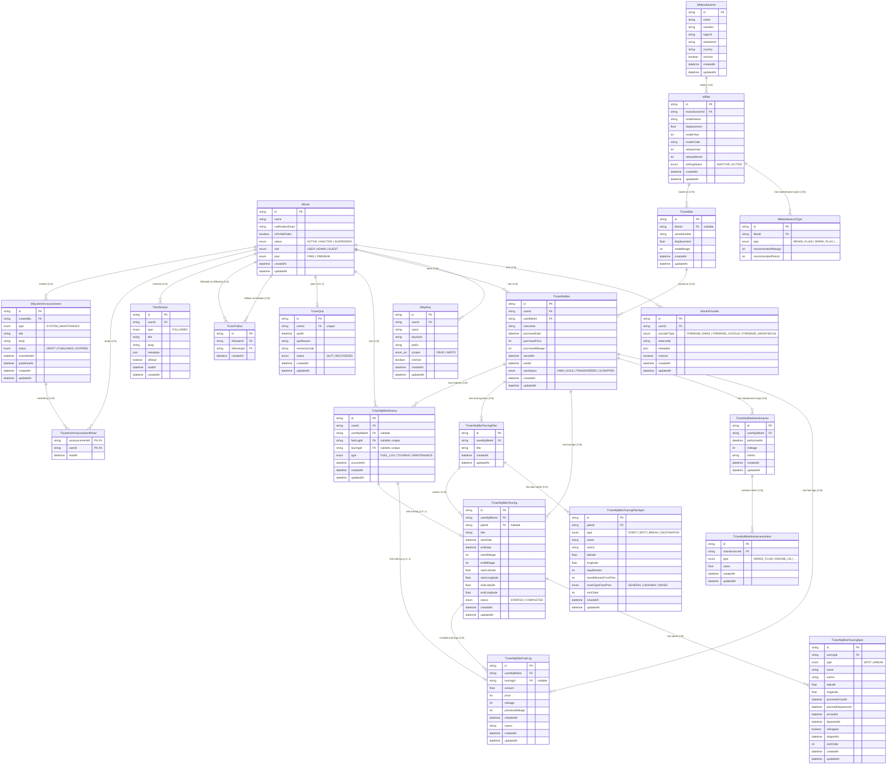
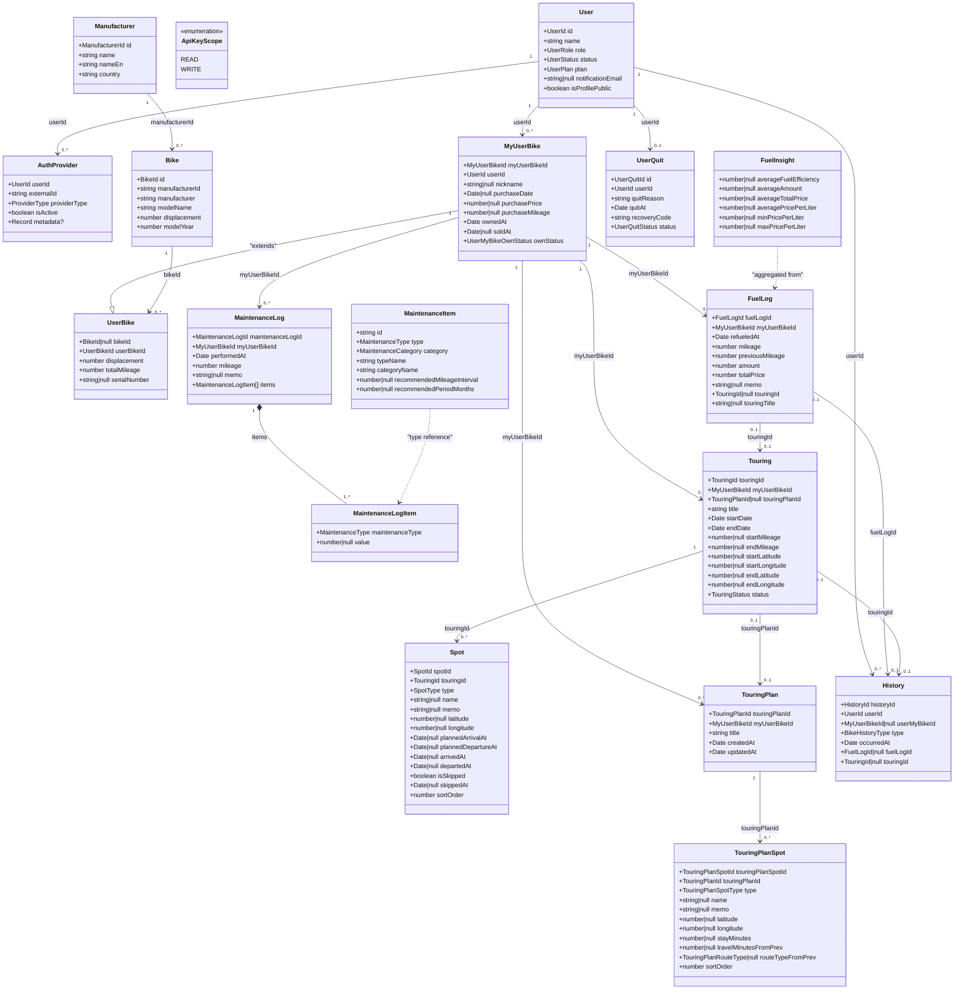
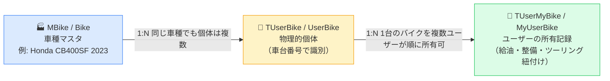

# ER図

## 1. DBスキーマ ER図（Prismaモデル）

> **テーブル命名規則**
> - `M` プレフィックス: マスターテーブル
> - `T` プレフィックス: トランザクションテーブル

---

## 2. Entityクラス ER図（ドメイン型）

> `packages/shared-types/src/domain/` に定義されたTypeScriptドメイン型の構造と関連を示します。

---

## バイク3層構造の概念図

バイクに関する3つの概念の関係をシンプルに示します。

> **設計意図**: TUserMyBike（MyUserBike）を分離することで、中古売買の際に前オーナーの給油・メンテ履歴が次オーナーに見えないようプライバシーを保護している。
